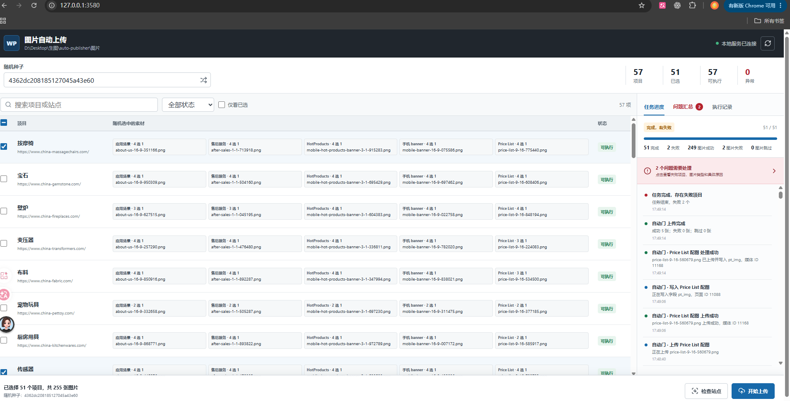
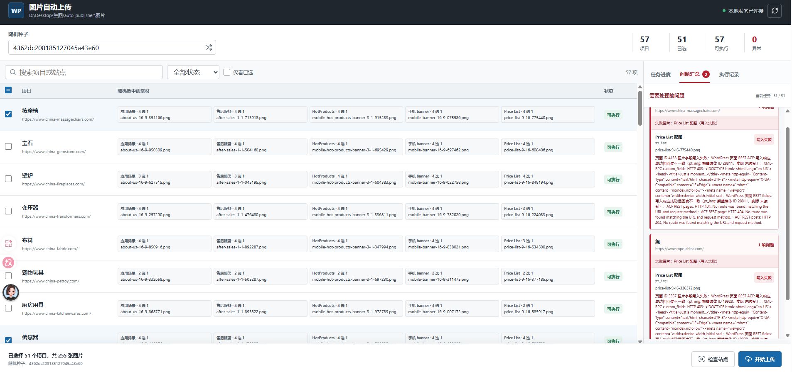
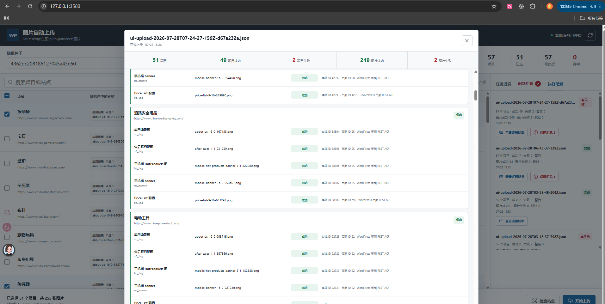
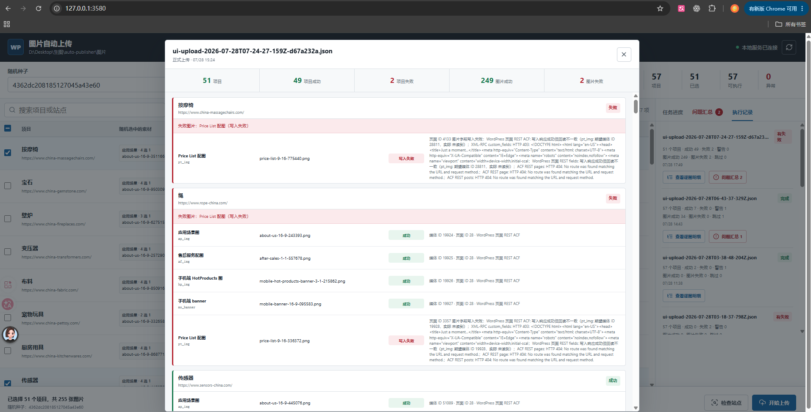

# WordPress 图片自动上传工具

该工具会读取 `图片` 下的项目文件夹，从每类素材中随机选择 1 张，依次上传到对应项目的 WordPress 媒体库，并更新网站内容字段。全程不调用 AI 模型，也不依赖浏览器插件。

## 字段对应

| 文件名前缀 | 页面 | WordPress/ACF 字段 |
| --- | --- | --- |
| `about-us-` | About Us | `ap_img` |
| `after-sales-` | About Us | `af_img` |
| `mobile-hot-products-banner-` | About Us | `hp_img` |
| `mobile-banner-` | About Us | `mo_banner`（写入 1 张） |
| `price-list-` | Price List | `pt_img` |

## 使用

环境要求：Node.js 20 或更高版本。当前电脑已有 Node.js 22，无需安装依赖。

### 可视化界面

双击 `start-ui.cmd`，或在 PowerShell 中运行：

```powershell
npm run ui
```

然后打开 <http://127.0.0.1:3580/>。界面支持搜索和勾选项目、重新随机素材、站点检查、正式上传、逐图片实时进度、安全停止以及可视化执行记录。执行记录可展开查看每个项目五张图的文件名、字段、媒体 ID、成功/失败阶段和错误原因。服务仅监听本机地址，WordPress 凭据不会发送到浏览器。

点击“停止任务”后，工具会完成当前项目再停止，并保存续跑检查点。重新打开或刷新界面时会自动沿用原随机种子：已经处理过的项目显示“已处理”且不可选择，只有从未开始的项目显示“待继续”并保持选中。点击“继续未完成”即可接着执行；点击“重新开始全部”才会退出续跑并重新选择完整批次。

### 命令行

先执行只读检查。它会校验图片、匹配项目并显示每个项目将要选择的文件，不会上传：

```powershell
npm run check
```

检查输出最后会给出随机种子。用同一个种子正式执行，确保实际选择与预览完全一致：

```powershell
npm run upload -- --seed <检查时显示的种子>
```

只处理一个项目：

```powershell
npm run check -- --project 宠物玩具 --seed test-001
npm run upload -- --project 宠物玩具 --seed test-001
```

只读检查所有项目能否访问 `about-us` 和 `price-list` 页面。该检查最多 5 路并发、单次请求 20 秒超时；正式上传仍严格逐项目执行：

```powershell
npm run check:sites
```

完整参数见：

```powershell
node src/cli.mjs --help
```

## 安全与失败处理

- 默认命令只检查，不写网站；必须显式使用 `--execute` 或 `npm run upload`。
- 项目账号从 KeyHub 的 `shop` 角色动态读取，不保存到代码和日志。
- 项目严格按顺序执行；单张图片失败后会继续处理该项目的其他图片，项目结束后继续下一个项目。
- 每次写入后都会回读 WordPress/ACF 字段并核对媒体 ID。
- WordPress 可能按字段设置返回媒体 URL；工具会反查媒体 ID 对应 URL 后校验，避免把成功写入误报为失败。
- 站点未定义某个 ACF 图片字段时，该字段会在上传前跳过并记录警告，其余字段和后续项目继续执行。
- 执行报告保存在 `logs`，逐项目、逐字段记录文件名、上传状态、写入状态、页面 ID、媒体 ID 和完整错误原因，不包含密码。
- 某个项目失败后，可根据报告用 `--project <项目名>` 单独重试。

## 项目名映射

工具会自动把文件夹末尾的 `(copy)`、`（copy）`、`(副本)` 或 `（副本）` 去掉后匹配，所以 `酱油(copy)` 会匹配项目 `酱油`。

其他不一致名称可将 `project-map.example.json` 复制为 `project-map.json` 后配置：

```json
{
  "素材文件夹名": "KeyHub 项目名"
}
```

项目展示界面：



